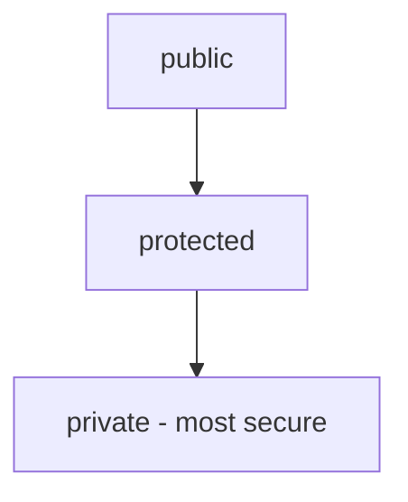

| Modifier  | Availability                         |
| --------- | ------------------------------------ |
| public    | All classes                          |
| protected | within the same class and subclasses |
| private   | only within the same class           |

## Level of security

