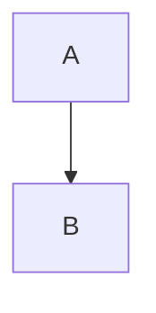
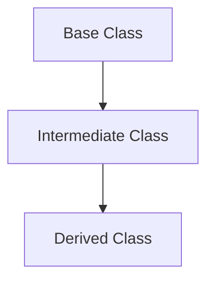
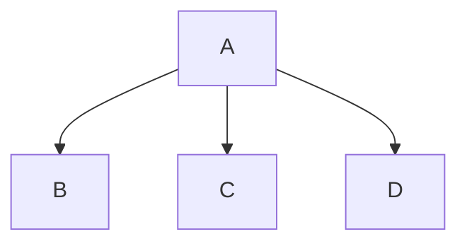

## Inheritance

- Inheritance is an important pillar of OOP(Object-Oriented
  Programming).
- It is the mechanism in java by which one class is allowed to inherit
  the features(fields and methods) of another class.
- Super Class: The class whose features are inherited is known as
  superclass.
- Sub Class: The class that inherits the other class is known as a
  subclass(or a derived class, extended class, or child class).
  The subclass can add its own fields and methods in addition to the
  superclass fields and methods.
- Reusability: Inheritance supports the concept of “reusability”, i.e. when
  we want to create a new class and there is already a class that includes
  some of the code that we want, we can derive our new class from the
  existing class.

## Single Inheritance:



```java
class A{
  public print(){
    System.out.println("Hello, there! :) ");
  }
}

class B extends A{}

public class Inheritance{
  public static void main(String[] args){
    B t = new B();

    // print is inherited even though not defined in two class
    t.print();
  }
}
```

## Multilevel Inheritance:



```java
class A{
  public print(){
    System.out.println("Hello, there! :) ");
  }
}

class B extends A{}

class C extends B{}

class Inheritance{
  public static void main(String[] args){
    C t = new C();

    // print is inherited even though not defined in two class
    t.print();
  }
}

```

## Hierarchical Inheritance



```java
class A{
  public print(){
    System.out.println("Hello, there! :) ");
  }
}

class B extends A{}
class C extends A{}
class D extends A{}

class Inheritance{
  public static void main(String[] args){
    B b = new B();
    C c = new C();
    D d = new D();

    // print is inherited even though not defined in two class
    b.print();
    c.print();
    d.print();
  }
}

```
