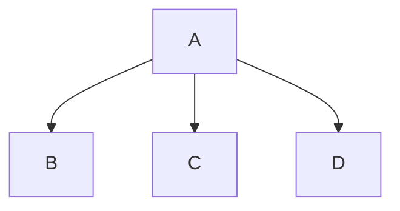
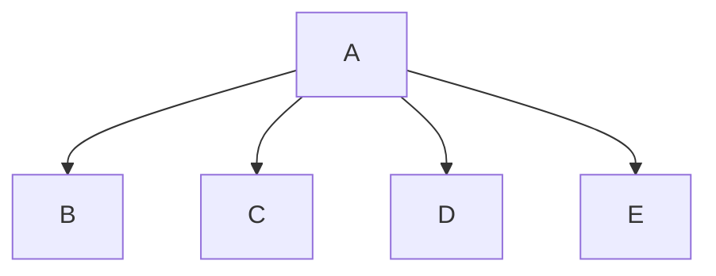

# Polymorphism

- Polymorphism in Java is a concept by which we can perform a single
  action in different ways.
- Polymorphism is derived from 2 Greek words: poly and morphs.
  The word ”poly” means many and ”morphs” means forms. So
  polymorphism means many forms.
- There are two types of polymorphism in Java: compile-time
  polymorphism and runtime polymorphism.
- We can perform polymorphism in java by method overloading and
  method overriding.

## Example :



```java
class A {}

class B extends A {}
class C extends A {}
class D extends A {}

class Main{
    public static void main(String[] args){
        A a = new A();
        B b = new B();
        C c = new C();
        D d = new D();

        print(a);
        print(b);
        print(c);
        print(d);
    }
}
```

This was our initial setup but some day we might have to change the structure & add a new element 'e' to the list. So we need to change the method signature. Polymorphism is the ability to perform the same action in different ways. So we can change the method signature to accept different types of objects.



```java
class A {}

class B extends A {}
class C extends A {}
class D extends A {}
class E extends A {}

class Main{
    public static void main(String[] args){
        A obj = new E();
        // we can even later change obj to B
        obj = new B();

        print(obj);
    }
}
```
