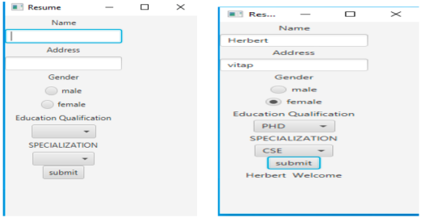

This is the solutions to the lab problems given in VIT-AP 2nd sem, Including some additional given by the instructor.

## Lab Problems

1. [problem 1](./prob1.java) Write a Java Program to define a class, describe its constructor, overload the Constructors
   and instantiate its object.
2. [problem 2](./prob2.java) Write a Java Program to define a class, define instance methods for setting and Retrieving
   values of instance variables and instantiate its object.
3. [problem 3](./prob3.java) Write a Java Program to define a class, define instance methods and overload them and use
   them for dynamic method invocation.
4. [problem 4](./prob4.java) Write a Java Program to implement array of objects.
5. [problem 5](./prob5.java) Write a Java Program to implement Wrapper classes and their methods.
6. [problem 6](./prob6.java) Write a Java Program to implement inheritance and demonstrate use of method overriding.
7. [problem 7](./prob7.java) Write a Java Program to implement multilevel inheritance by applying various access
   controls to its data members and methods.
8. [problem 8](./prob8.java) Write a Java program to demonstrate use of implementing interfaces.
9. [problem 9](./prob9.java) Write a Java program to implement the concept of importing classes from user defined
   package and creating packages.
10. [problem 10](./prob10.java) Write a program to implement the concept of threading by implementing Runnable Interface.
11. [problem 11](./prob11.java) Write a Java program to implement the concept of Exception Handling using predefined
    exception.
12. [problem 12](./prob12.java) Write a Java program to implement the concept of Exception Handling by creating user defined exceptions.
13. [problem 13](./prob13.java) Write a Java program using Collections.
14. [problem 14](./prob14.java) Write a Java Program using Generics.
15. [problem 15](./prob15.java) Write a Java Program to implement multi-threading.
16. [problem 16](./prob16.java) Write a Java Program to implement Synchronization.
17. [problem 17](./prob17.java) Write a Java Program to implement inter thread communication.

### GUI Problems

18. [problem 18](./GUIProbs/src/prob18) Programs using JavaFX canvas.
19. [problem 19](./GUIProbs/src/prob19) The following JavaFX GUI counter contains 3 controls (or components): a Label, a Text Field and a Button.
    Clicking the button increases the count displayed in the text field.
20. [problem 20](./GUIProbs/src/prob20) Write a JavaFX program that works as a simple calculator.
    Use a grid layout to arrange buttons for the digits and for the +, -, \*, % operations.
    Add a text field to display the result. Handle any possible exceptions like divide by zero.
21. [-]() Write a JavaFX program that creates a menu.

- Assignment Problems

31. [problem 31](./GUIProbs/src/AssignmentProblems/prob31.java) Design a Java FX application for designing an application for taking a quiz online
    which has at least one question and four radio buttons for choices or answers and
    there should also be a button called submit to submit the answer?

32. [problem 32](./GUIProbs/src/AssignmentProblems/prob32.java) Develop a Java FX application which has flow layout, and which has three buttons
    namely college, department, and name. When the college button is clicked display
    “VIT-AP University” should be displayed on the window and when the department
    button is clicked “SCOPE” should be displayed and when the name button is pressed
    then your name should be displayed?

33. [problem 33](./GUIProbs/src/AssignmentProblems/prob33.java) Develop a Java FX application which looks like as shown below:
    

34. [problem 34](./GUIProbs/src/AssignmentProblems/prob34.java) Write a javaFX program to design the form below. Use RadioButton for gender,
    Combo box for Education Qualification (BE, ME, PHD, BTECH,BSC) and ListView
    for department (CSE, ECE,EEE,MECH) and Checkbox for programming skill (allow
    multiple select) and Button “Submit”. When the submit button is clicked it has to
    display all the Details.
    

### Digital Assignment

1. Develop a java program to implement List interface by using stack class and linkedlist classes. (It should include all the methods of List interface).

   - [Stack class](./Digital%20%20Assignment/StackAssign.java)
   - [Linked List](./Digital%20%20Assignment/LinkedListAssign.java)

2. Develp a java program to implement Set interface by using TreeSet class and EnumSet class.

   - [Tree set](./Digital%20%20Assignment/TreeSetAssign.java)
   - [Stack class](./Digital%20%20Assignment/EnumSetAssign.java)

3. Develp a java program to implement queue interface by using ArrayDeque class and LinkedList class and priority queue class.
   - [ArrayDeque](./Digital%20%20Assignment/ArrayDequeAssign.java)
   - [Linked List as Queue](./Digital%20%20Assignment/LinkedListAsQueueAssign.java)
   - [Prority Queue](./Digital%20%20Assignment/PriorityQueueAssign.java)

### Assignment Problems

#### Questions on Generics:

22. [problem 22](./Assignment%20Problems/prob22.java) Create two classes called CompAEmp and CompBEmp extending Emp class. Create a
    generic class called MyEmployeeUtil, which defines utilities to perform employee
    functions irrespective of which comapany emp belogns too. This class accepts
    subclasses of Emp. Compare the salary of two employees using MyEmployeeUtil
    class.

23. [problem 23](./Assignment%20Problems/prob23.java) Create a class Complex which has real and imaginary values represents the
    numeric values. The class has one parametrized constructor to initialize real and
    imaginary part of complex number. The generic class Complex implements in-built
    interface Comparable. Write the java program to find bigger complex number from
    the pair of complex number using comparable interface.

24. [problem 24](./Assignment%20Problems/prob24.java) Bob want to search a particular number in available list of arranged numeric
    numbers. Will you help him to find a numeric number using java program with the
    concept of generic?

#### Questions on Thread:

25. [problem 25](./Assignment%20Problems/prob25.java) Creates the 4 threads and achieve the synchronization among threads for following
    tasks.

    - It accepts the multi-digit number
    - Performs the sum of digits of given number until it gets the single digit
      number
    - Calculate the factorial of number which is returned by task b above task.
      Note: For each task define the separate methods.

26. [problem 26](./Assignment%20Problems/prob26.java) To achieve the parallel execution in multi-threaded environment, we have created
    the 4 threads to perform the given task. The task is to take the string from the user,
    return the maximum occurring character in that string, and then remove all the
    occurrences of the maximum occurring character from string. Implement all given
    task with multi-threaded environment with synchronization among all threads.
    Note: design function for each task.

27. [problem 27](./Assignment%20Problems/prob27.java) Implement the java program for the following scenario: Generate the multithreaded environment where the Producer generates an integer between 0 and 9
    (inclusive), stores it in a CubbyHole object. To make the synchronization, Producer
    waits for a random amount of time between 0 and 100 milliseconds before
    repeating the number-generating cycle. The Consumer consumes all integers from
    the CubbyHole (the exact same object into which the Producer put the integers in
    the first place) as quickly as they become available.

28. [problem 28](./Assignment%20Problems/prob28.java) Consider the bank has 5 counters for serving the customers. And the bank serves
    maximum of 100 tokens / day. There is one token vending machine which is
    generating token continuously for each customer. When a customer arrives in bank
    for some work, he /she needs to collect a token from the token vending machine
    (The Producer). Now the customer needs to wait for some time to be served from
    one of the 5 counters (The Consumers)

29. [problem 29](./Assignment%20Problems/prob29.java) Automatic vending machine is installed for selling of snacks packet in VIT-AP. The
    maximum size of this machine is 1000 packs at a time. If sells manager want to add
    more items (more than 1000), it has to wait until there is space for packs
    (Producer). Then there is no item in vending student has to wait until the sales
    manager puts items into the machine (Consumer).

30. [problem 30](./Assignment%20Problems/prob30.java) Consider the automatic parking slot of VIT-AP. In the institute parking slots we can
    park maximum 200 vehicle at time. There is automated system which displays
    parking place for each vehicle which are entering inside the campus of VIT-AP.
    When vehicle enters inside the campus, it needs to check the display to get the free
    slot for parking (The Producer). Vehicle has to be wait for some time to get the
    parking slot if slot is completely filled.

    > Didn't quite understand the flow should ask for confirmation of exec flow.
